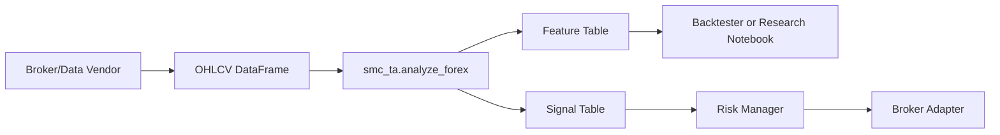

# Python Bot Integration

This package is designed to sit between market data ingestion and broker execution.



## Expected Candle Shape

```python
columns = ["open", "high", "low", "close", "tick_volume", "spread"]
```

The index should be time-based and sorted ascending. UTC is recommended.

## Example Live Loop

```python
from smc_ta import analyze_forex

def on_new_closed_candle(candles):
    result = analyze_forex(candles, symbol="EURUSD")
    signal = result.signals.iloc[-1]

    if signal["side"] == "flat":
        return None

    return {
        "side": signal["side"],
        "confidence": float(signal["confidence"]),
        "reasons": signal["reasons"],
    }
```

## Required Before Live Trading

- Demo-tested broker adapter for orders, positions, and account state
- Economic calendar/news source
- Spread and slippage model selected for the target broker
- Session schedule adjusted for daylight saving time when needed
- Backtesting engine with realistic transaction costs
- Demo forward testing
- Risk limits: max daily loss, max open trades, max correlated exposure

## Current Live-Readiness Modules

- `OandaBroker` and `OandaCandleDataSource` for OANDA v20 REST demo/live accounts
- `MetaTrader5Broker` and `MetaTrader5CandleDataSource` for local MT5 terminal workflows
- `JsonEconomicCalendarSource` for provider-specific calendar APIs
- `SQLiteTradeJournal` for persistent local journals
- `BrokerReconciler` for blocking when broker positions differ from bot ledger state
- `EmergencyStopController` for hard stop, manual stop file, drawdown, equity, runtime-error, and optional close-all controls
- `run_walk_forward` for train/test validation before demo/live use
- `validate_candle_quality` for missing candles, duplicate timestamps, invalid OHLC, spread spikes, weekend candles, and range spikes
- `analyze_multi_timeframe` for higher-timeframe context
- `classify_smc_setups` for setup labels
