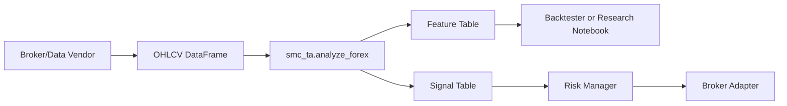

# Python Bot Integration

This package is designed to sit between market data ingestion and broker execution.



## Expected Candle Shape

```python
columns = ["open", "high", "low", "close", "tick_volume", "spread"]
```

The index should be time-based and sorted ascending. UTC is recommended.

## Example Live Loop

```python
from smc_ta import analyze_forex

def on_new_closed_candle(candles):
    result = analyze_forex(candles, symbol="EURUSD")
    signal = result.signals.iloc[-1]

    if signal["side"] == "flat":
        return None

    return {
        "side": signal["side"],
        "confidence": float(signal["confidence"]),
        "reasons": signal["reasons"],
    }
```

## Required Before Live Trading

- Broker adapter for orders, positions, and account state
- Economic calendar/news filter
- Spread and slippage model
- Session schedule adjusted for daylight saving time when needed
- Backtesting engine with realistic transaction costs
- Demo forward testing
- Risk limits: max daily loss, max open trades, max correlated exposure

